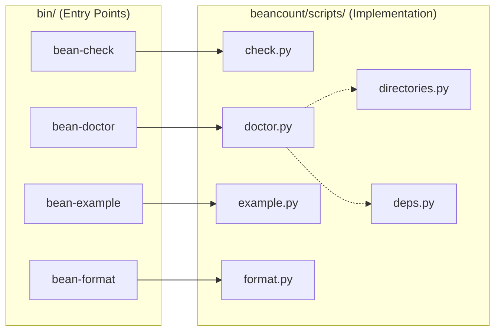

# Beancount Scripts

This directory contains the implementation of the main command-line tools provided by Beancount. These Python scripts are typically invoked via wrapper scripts located in the `bin/` directory of the project root.

The primary goal of organizing the scripts here is to keep significant code under a single directory for easier analysis, testing, and maintenance.

## Key Scripts & Tools

Each script generally corresponds to a `bean-*` command.

### `check.py` (`bean-check`)
The primary validation tool for Beancount ledgers.
- **Functionality**: Loads a Beancount file, runs the parser and all validation checks, and reports errors.
- **Key Features**:
  - Validates syntax and transactions.
  - Can output errors in JSON format for IDE integration.
  - Supports strict validation modes.

### `doctor.py` (`bean-doctor`)
A multi-purpose debugging and diagnostic tool. It offers various subcommands to inspect the internal state of the parser and the ledger.
- **Subcommands**:
  - `lex`, `parse`: Dump lexer tokens or parser output for debugging.
  - `context`: specific context at a file location.
  - `linked`: List transactions linked to a specific tag or link.
  - `missing-open`: Identify accounts that are used but not explicitly opened.
  - `list-options`, `print-options`: Inspect configuration options.
  - `directories`: Validates that a directory hierarchy matches the account structure (uses `directories.py`).

### `example.py` (`bean-example`)
Generates a comprehensive, realistic example Beancount file.
- **Purpose**: Creates a large dataset for testing, benchmarking, or demonstration purposes.
- **Details**: Simulates a user's financial life including salary, expenses, investments, and taxes over a specified date range.

### `format.py` (`bean-format`)
A source code formatter for Beancount files.
- **Approach**: Uses regular expressions rather than a full parser round-trip. This ensures that comments and file structure are strictly preserved while aligning numbers and currencies.
- **Features**: Aligns amounts to a specific column or automatically determines the optimal width.

### Helper Modules

- **`deps.py`**: Checks for required runtime dependencies and their versions (e.g., Python version, `python-magic`).
- **`directories.py`**: Contains logic to validate if a directory structure on disk mirrors the account hierarchy defined in the ledger. Used by `doctor.py`.

## Architecture & patterns

Most scripts in this directory follow these patterns:
- **CLI Framework**: Use `click` for command-line argument parsing.
- **Entry Points**: Each file typically has a `main()` function and an `if __name__ == "__main__":` block, allowing them to be run directly or imported.
- **Loader Integration**: They rely heavily on `beancount.loader` to ingest and process Beancount input files.

## Relationship Diagram

